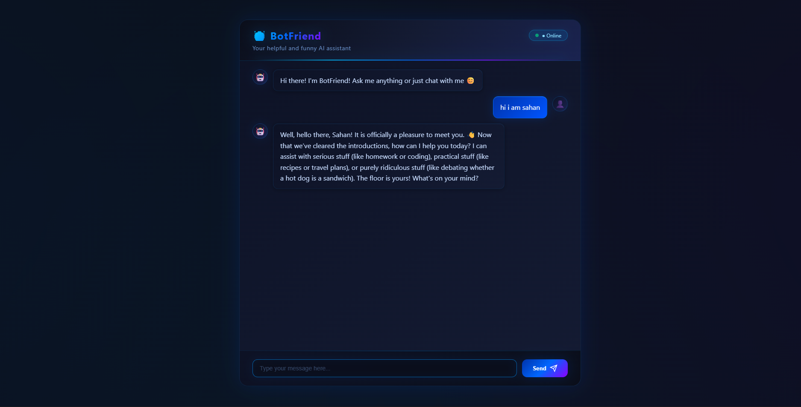

# BotFriend

A modern and friendly chatbot web app powered by the Gemma 4 model through the OpenRouter API. BotFriend combines a simple frontend experience with a fast Node.js backend to deliver conversational AI right in your browser.

## 🖼️ Preview



## ✨ Features

- Real-time chat experience with a clean and responsive UI
- Backend API built with Express.js
- Secure API key handling through environment variables
- Conversation history support for each chat session
- Lightweight and easy to run locally

## 🛠️ Tech Stack

- Frontend: HTML, CSS, JavaScript
- Backend: Node.js, Express.js
- AI Provider: OpenRouter API
- Model: google/gemma-4-26b-a4b-it:free

## 📁 Project Structure

```bash
BotFriend/
├── backend/
│   ├── index.js
│   ├── package.json
│   └── .env
└── frontend/
    ├── index.html
    ├── style.css
    └── script.js
```

## 🚀 Getting Started

### 1. Clone the repository

```bash
git clone https://github.com/sahannavo/BotFriend
cd BotFriend
```

### 2. Install backend dependencies

```bash
cd backend
npm install
```

### 3. Configure your environment

Create a `.env` file inside the `backend` folder and add your OpenRouter API key:

```env
OPENAI_API_KEY=your_openrouter_api_key_here
PORT=3000
```

### 4. Start the backend

```bash
node index.js
```

The server will run at:

```bash
http://localhost:3000
```

### 5. Open the frontend

Open the `frontend/index.html` file in your browser or serve the folder using a simple static server.

## 📡 API Endpoints

- `POST /chat` — Send a user message and receive an AI response
- `GET /health` — Check whether the backend is running

## 💡 Example Request

```bash
curl -X POST http://localhost:3000/chat \
  -H "Content-Type: application/json" \
  -d '{"message":"Hello!","sessionId":"demo"}'
```

## 🤝 Contributing

Contributions are welcome. Feel free to fork the project, improve it, and submit a pull request.

## 📜 License

This project is licensed under the ISC License.
